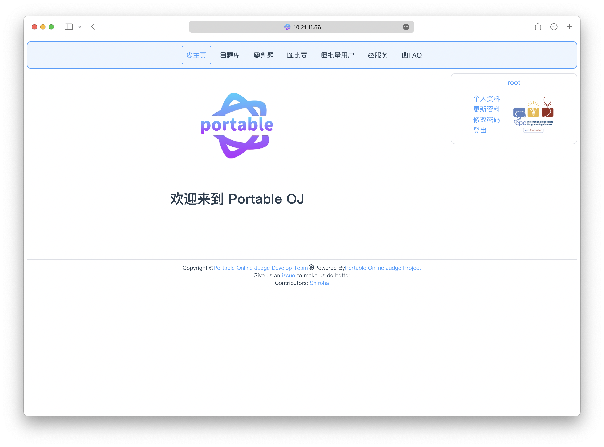
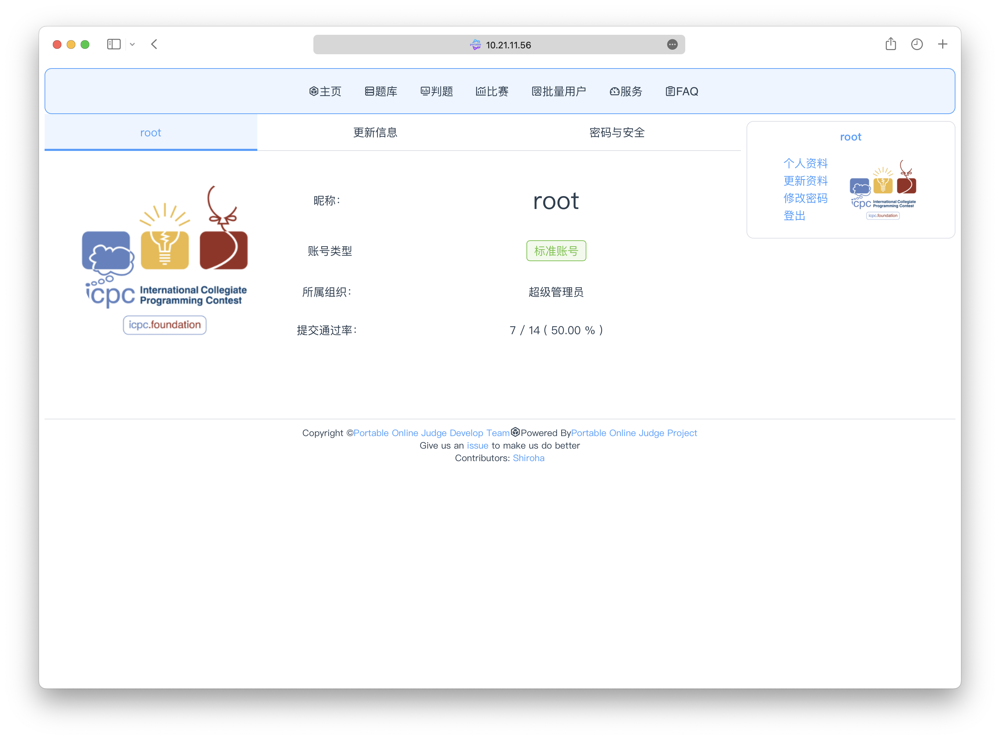

# 信息的查看和管理

## 前往个人信息页面

你可以在绝大部分页面的右侧找到你的个人小卡片，这里会显示当前的登录状态

点击小卡片的头像、名称、「个人资料」按钮后，将会转跳至个人信息页面

## 查看个人信息

通常，个人信息中会包含下面几个字段

 - 昵称：你的昵称，也就是你的用户名
 - 账号类型：描述了你的账号类型
    * 标准账号：这是一个普通的账号，其能够正常进行绝大部分的操作
    * 批量账号：这是一个批量账号，其不能进行很多的操作，且登录受限
 - 所属组织：账号的所属组织，组织决定了用户之间的管理关系，高级组织的成员可以管理低级组织的成员
 - 提交通过率：你在公开题库中的提交和通过数量
 - 关联比赛：批量用户通常与比赛相关联，这里将会提供快速前往关联比赛的按钮

## 组织

组织是本系统中用来管理用户上下级关系的工具，组织仅仅与用户之间关系相关，并不与其他任何实体有关。

例如，A 的组织可以管理 B 组织，在不考虑有特殊的权限下，则

 - A 可以调整 B 的组织，可以调整至任何 A 仍然可以管理的组织
 - A 可以授予 B 权限
 - A 可以重置 B 的密码
 - A 不可以查看 B 的私有题目
 - A 不可以编辑 B 的所有题目
 - A 不可以进入 B 创办的非公开比赛
 - A 不可以管理 B 创办的公开比赛
 - A 不可以查看 B 提交的代码

你可以看到，所有与组织相关的权限，均要求是用户与用户之间的管理，而一旦涉及到其他实体，则都不被直接允许。

下面是目前现有的组织。后方的编号代表了这个组织的权限，若 A & B = A，则表明 B 可以管理 A

 - 普通学生         0x00
 - 特别的学生       0x01
 - 老师             0x03
 - 集训队成员       0x05
 - ACM 会长         0x07
 - 荣誉集训队成员   0x0f
 - 教练             0x1f
 - 超级管理员       0xff

当然，相同组织之间是不允许相互管理的

