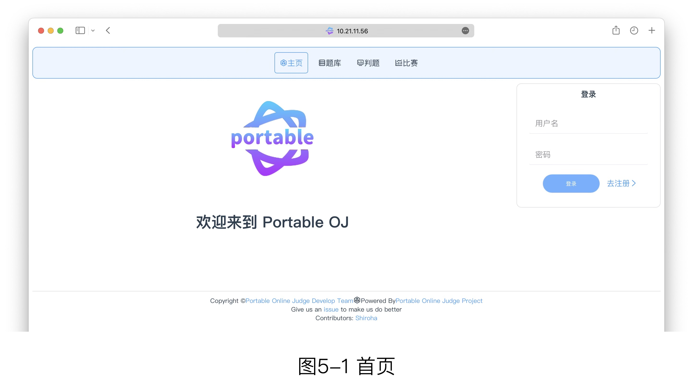
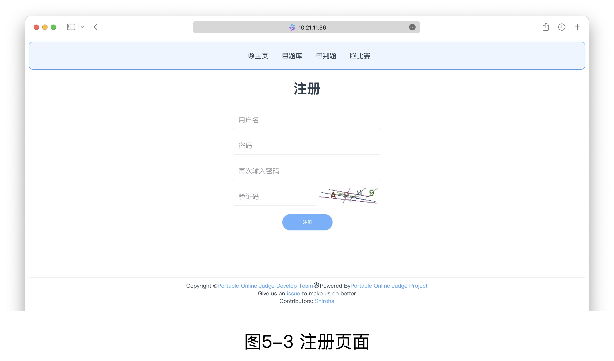

# 注册与登录

## 注册

用户可以通过系统提供的注册页面来注册自己的普通用户账户。

在任何一个没有登录的页面上，你都可以在系统右侧找到“去注册”按钮，点按后将前往注册页面。例如下图的中的首页，你可以在屏幕右侧找到注册和登录按钮

点击去注册按钮后，根据要求填写信息后即可完成注册，内容如下：

其中的字段的描述如下

 - 用户名：这是你在系统中唯一标识你身份的的名称，必须是唯一的。你的下一次登录必须通过用户名进行登录，若遗忘用户名则将永远无法找回，请记住用户名。
 - 密码：你登录时使用的密码，用来唯一表示你是此账号主人的身份。请不要随意向外透露你的密码。
 - 再次输入密码：为了避免你在输入密码时错误输入，这里仅用于确认你两次输入的密码相同。
 - 验证码：你需要准确的输入验证码，来表明你不是一个机器人。

## 登录

你可以在绝大部分页面的右侧找到登录的小卡片，输入用户名和密码后，点击登录即可完成登录

